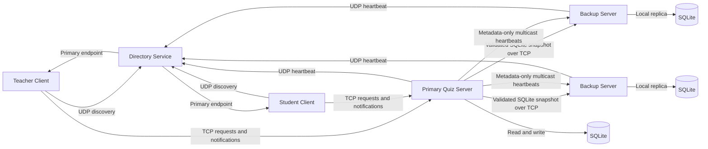

> **Academic Project — Instituto Superior de Engenharia de Coimbra (ISEC)**
>
> This public repository is a portfolio-ready version. The original academic submission is preserved separately in a private `-isec-archive` repository; later improvements may be present here.

 <div align="center">

# Distributed Quiz Platform

### Fault-tolerant question-and-answer system built with Java and distributed systems concepts


</div>

## Overview

**Distributed Quiz Platform** is a fault-tolerant client-server system for creating and answering multiple-choice questions in a classroom environment.

The platform supports teachers and students through a JavaFX desktop application. Behind the interface, a cluster of servers provides service discovery, local database replication, asynchronous notifications and recovery from server failures.

Only one server handles client requests at a given time. The remaining servers operate as backups, maintaining synchronised SQLite databases and becoming eligible to replace the primary server when it becomes unavailable.

The project was designed to explore practical distributed-systems concepts such as:

- Service discovery;
- Primary-backup replication;
- Heartbeats and failure detection;
- TCP, UDP and multicast communication;
- Automatic client reconnection;
- Concurrent request processing;
- Asynchronous notifications;
- Local database consistency.

## Main Features

### Teacher

Teachers can:

- Create and update their profile;
- Register using a protected teacher registration code;
- Authenticate using email and password;
- Create multiple-choice questions;
- Define question options and the correct answer;
- Configure question availability periods;
- Generate access codes automatically;
- View active, upcoming and expired questions;
- Filter questions by their current state;
- Edit or delete questions without submitted answers;
- View student answers;
- Analyse answer statistics;
- Export question results to CSV;
- Receive asynchronous updates;
- End their session securely.

### Student

Students can:

- Create and update their profile;
- Authenticate using email and password;
- Join an active question using an access code;
- Submit one answer per question;
- View previously answered questions;
- Check whether an answer was correct after the question expires;
- Receive asynchronous question updates;
- Recover their session after reconnecting to another server;
- End their session securely.

## Distributed Architecture

The system is divided into three main components:

| Component | Responsibility |
| --- | --- |
| **Client** | JavaFX application used by teachers and students |
| **Directory Service** | Tracks active servers and returns the current primary server |
| **Quiz Server** | Processes requests, manages business logic and persists data in SQLite |



A more detailed interaction diagram is available in [`docs/Geral.png`](docs/Geral.png).

## How the Distributed System Works

### 1. Server discovery

The directory service starts before the other components and listens for UDP messages.

Every quiz server registers its current database version with the directory service. The healthy server with the highest valid `db_version` is elected primary; registration order and server ID provide deterministic tie-breaks.

Clients contact the directory service to obtain the address and TCP port of that primary server.

### 2. Primary and backup servers

The primary server:

- Accepts client connections;
- Processes authentication and business operations;
- Updates its local SQLite database;
- Propagates database changes to backup servers;
- Sends asynchronous notifications to connected clients.

Backup servers:

- Maintain their own SQLite database;
- Receive an initial full database copy through TCP;
- Receive subsequent updates through multicast;
- Track database version numbers;
- Can replace the primary server after a failure.

### 3. Heartbeats and failure detection

Servers periodically send heartbeat messages to:

- The directory service;
- The multicast server group.

Heartbeats carry information such as:

- Server identifier;
- Server role;
- Client TCP port;
- Database-copy TCP port;
- Current database version.

The directory service removes servers that stop sending heartbeats within the configured timeout.

### 4. Database replication

When a backup is missing a database or observes a newer primary version, it requests a complete snapshot through TCP. The primary creates a consistent SQLite snapshot with `VACUUM INTO`, including committed WAL data, and sends its size, logical version and SHA-256 digest.

The backup validates the byte count, checksum, SQLite integrity and `db_version` before atomically replacing its local database. A failed transfer is retried on a later heartbeat; version mismatch triggers resynchronisation rather than automatic shutdown. SQL statements never travel in multicast datagrams.

### 5. Automatic client recovery

When the connection to the current server is lost, the client:

1. Contacts the directory service again;
2. Requests the current primary server;
3. Connects to the new server;
4. Restores the previous authenticated session when possible;
5. Updates the JavaFX interface with the new connection status.

This recovery process is designed to minimise disruption to the user.

## Communication Protocols

| Communication | Protocol | Purpose |
| --- | --- | --- |
| Client → Directory | UDP | Primary-server discovery |
| Server → Directory | UDP | Registration, heartbeat and deregistration |
| Client ↔ Primary Server | TCP | Authentication, questions, answers and notifications |
| Backup → Primary Server | TCP | Validated SQLite snapshot transfer |
| Server ↔ Server | UDP Multicast | Metadata-only version and endpoint heartbeats |

## Security

The authentication layer includes:

- Password hashing using **PBKDF2 with HMAC-SHA-256**;
- Salted password representations;
- Unique email constraints;
- Unique student-number constraints;
- Authentication-required operations;
- Role-based separation between teachers and students;
- Session tracking;
- Strict Java deserialisation allow-list and resource limits;
- Authenticated PING/PONG liveness with bounded reads;
- Server-side validation of permissions.

No plaintext password is stored in the SQLite databases.

## Technology Stack

| Area | Technology |
| --- | --- |
| Programming language | Java 23 |
| Desktop interface | JavaFX 20 |
| Build system | Apache Maven |
| Persistence | SQLite |
| Database access | JDBC |
| Object serialisation | Java serialisation |
| Network communication | TCP, UDP and multicast |
| Concurrency | Java threads and concurrent collections |
| Console output | Jansi |
| Testing support | JUnit 5 |

## Project Structure

```text
distributed-quiz-platform/
├── src/
│   └── main/
│       ├── java/
│       │   └── pt/isec/
│       │       ├── client/
│       │       │   ├── core/
│       │       │   ├── services/
│       │       │   ├── threads/
│       │       │   └── ui/
│       │       ├── server/
│       │       │   ├── core/
│       │       │   ├── db/
│       │       │   ├── services/
│       │       │   └── threads/
│       │       ├── directory/
│       │       │   ├── core/
│       │       │   └── threads/
│       │       └── common/
│       │           ├── dto/
│       │           ├── messages/
│       │           ├── model/
│       │           └── util/
│       └── resources/
│           ├── db/
│           ├── imgs/
│           └── styles/
├── docs/
├── diagrams/
├── guide/
└── pom.xml
```

## Main Packages

### `client`

Contains the JavaFX application, controllers, views, client-side services and communication threads.

The client interface and communication logic are kept separate so that UI operations do not directly manage network connections.

### `server`

Contains the main business logic, TCP connection management, database access, authentication, question management, answer processing and replication mechanisms.

### `directory`

Contains the service-discovery component responsible for tracking active servers and identifying the current primary server.

### `common`

Contains shared objects used by every component:

- Domain models;
- Data-transfer objects;
- TCP and UDP messages;
- Message types;
- Utility classes.

## Database Model

Each quiz server maintains an independent SQLite database containing:

| Table | Purpose |
| --- | --- |
| `config` | Database version and teacher-code hash |
| `teacher` | Teacher profiles and credentials |
| `student` | Student profiles and credentials |
| `session` | Authentication and session information |
| `question` | Question statements, access codes and availability |
| `option` | Multiple-choice options |
| `answer` | Student answers |

Foreign keys and uniqueness constraints are used to preserve data integrity.

## Requirements

The current version is configured primarily for Windows.

You will need:

- Windows 10 or Windows 11;
- JDK 23;
- Apache Maven;
- A network interface that supports multicast;
- UDP and TCP ports available for the directory and quiz servers.

## Configuration

### Directory service

The default directory port is:

```text
9999/UDP
```

The directory service can also receive custom arguments:

```text
MainDirectory <udpPort>
```

or:

```text
MainDirectory <udpPort> <queueCapacity> <maxPacketSize> <ttlMillis>
```

### Quiz server

Each server receives:

```text
MainServer <directoryHost> <directoryPort> <dataDirectory> <multicastInterface> <clientPort> <databaseCopyPort>
```

Example:

```text
MainServer localhost 9999 PROJECT AUTO 5010 17010
```

Where:

- `localhost` is the directory-service host;
- `9999` is the directory UDP port;
- `PROJECT` stores databases inside the project data directory;
- `AUTO` selects a multicast-compatible interface;
- `5010` accepts client TCP connections;
- `17010` accepts database-copy connections.

Every additional server must use different TCP ports.

### Client

The client defaults to `localhost:9999`. Override the directory endpoint with
JavaFX named arguments:

```bash
mvn javafx:run -Djavafx.args="--directory-host=directory.example --directory-port=9999"
```

The same values can be supplied through JVM properties:

```text
quiz.directory.host
quiz.directory.port
```

or environment variables `QUIZ_DIRECTORY_HOST` and `QUIZ_DIRECTORY_PORT`.
Arguments take precedence over properties, which take precedence over the
environment.

## Build

Compile the project with Maven:

```bash
mvn clean compile
```

Create the project package:

```bash
mvn clean package
```

Run the complete unit and integration test suite:

```bash
mvn clean test
```

The suite covers authentication/roles, question and answer rules, persistent
sessions, JDBC rollback, snapshot/WAL/checksum behavior, loopback TCP transfer,
election, liveness and serialisation filtering. See
[`LEGACY_VALIDATION.md`](LEGACY_VALIDATION.md) for the latest result and the
repeatable three-server/two-client failover gate.

Run the explicit local multi-process and JavaFX smoke gate with:

```bash
mvn -B -Dtest=LegacyMultiProcessSmoke test
```

## Running on Windows

The repository includes Windows batch scripts under:

```text
src/main/java/batchFiles/
```

The scripts use `AUTO` for multicast selection and accept explicit endpoint and
port arguments. They invoke Maven, so copied JARs or JavaFX runtimes are not
required.

### Minimal environment

Starts one directory service, one server and one client:

```bat
cd src\main\java\batchFiles
run_all_test.bat
```

### Replicated environment

Starts one directory service, three servers and two clients:

```bat
cd src\main\java\batchFiles
run_all.bat
```

### Start components individually

Start them in this order:

```bat
run_directory.bat
run_server.bat
run_client.bat
```

Additional backup servers can be started with:

```bat
run_server2.bat
run_server3.bat
```

## Example Workflow

### Teacher workflow

1. Register a teacher account;
2. Authenticate;
3. Create a multiple-choice question;
4. Configure its availability period;
5. Share the generated access code;
6. Receive answer notifications;
7. View results and statistics;
8. Export the results to CSV.

### Student workflow

1. Register a student account;
2. Authenticate;
3. Enter the question access code;
4. Select and submit an answer;
5. Wait for the question to expire;
6. View the answer history and result.

## Documentation

The repository includes additional architecture and interaction diagrams:

- [`docs/Geral.png`](docs/Geral.png) — complete system interaction;
- [`docs/Directory.png`](docs/Directory.png) — directory-service flow;
- [`docs/Server.png`](docs/Server.png) — server behaviour;
- [`docs/Client.png`](docs/Client.png) — client behaviour;
- [`docs/Comunicação_geral.png`](docs/Comunicação_geral.png) — communication overview.

## Academic Context

This project was developed as a collaborative assignment for the **Distributed Programming** course of the Bachelor's Degree in Computer Engineering at the **Instituto Superior de Engenharia de Coimbra — ISEC**, during the 2025/2026 academic year.

The project focused on applying distributed-systems concepts through a complete implementation rather than relying on external distributed-system frameworks.

## Current Scope

The implemented version uses Java sockets and object-based message exchange.

REST and RMI interfaces were considered as part of the architectural planning, but they are not implemented in the current version.

The academic node protocol does not authenticate or cryptographically protect
messages between directory and quiz-server processes. Run it only on a trusted
demonstration network. JavaFX dependencies are currently selected for Windows;
cross-platform packaging has not been validated.

## Licence

No open-source licence is granted by this repository. The code and bundled
resources remain subject to the rights of their respective authors. Resource
provenance must be confirmed before public redistribution.

---

<div align="center">

Developed as a distributed-systems engineering project.

</div>
